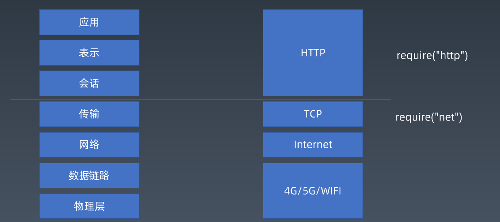

# HTTP 协议



上图就是网络模型。我们大学课堂上学的是 7 层网络模型，但是实际上，我们很多时候讲的是 4 层模型。

在 Node.js 中，我们可以轻松地使用 http 包和 net 包来实现网络交互。

## TCP 和 IP

TCP 中经常碰到的概念如下：

- 流
- 端口
- Node 中的 net 包

IP 中经常碰到的概念如下：

- 包
- IP 地址
- C++ 包 libnet/libpcap

## HTTP

HTTP 是在 TCP 的基础上，额外定义了 Request 和 Response。相比于 TCP 的全双工通道，HTTP 要求必须先发起一个 Request 请求，才会返回一个 Response。

[HTTP 协议的标准](https://tools.ietf.org/html/rfc2616)在 IETF 上，是一种文本型的协议。由于 HTTP 处于 TCP 上层，可以理解为所有流淌在 TCP 流里的都是字符。

## Request

Request 的形式需要符合以下标准：

```text
Request = Request-Line
          *(( general-header
           | request-header
           | entity-header ) CRLF)
          CRLF
          [ message-body ]
```

常见的例子是：

```text
POST / HTTP/1.1
host: 127.0.0.1
Content-Type: application/x-www-form-urlencoded
Content-Length: 19

field1=aaa&code=bbb
```

有两种 Content-Type 必须要学会：

1. `application/x-www-form-urlencoded`

   body 的形式为 `field1=aaa&code=bbb`

2. `application/json`

   body 的形式为 `{"name": "frank"}`

注意，如果传递了 body，还需要指定 Content-Length。

## Response

Response 的形式需要符合以下标准：

```text
Response = Status-Line
           *(( general-header
            | response-header
            | entity-header ) CRLF)
           CRLF
           [ message-body ]

```

常见的例子是：

```text
HTTP/1.1 200 OK
Content-Type: text/html
Date: Sun, 04 Oct 2020 12:02:37 GMT
Connection: keep-alive
Transfer-Encoding: chunked

c
Hello world

0

```
