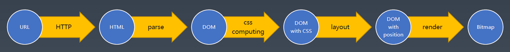

# 浏览器

上图是我们在浏览器中输入一个 URL 后，发生的事情:

1. 浏览器发送 HTTP 请求到后端，后端返回 HTML
2. 浏览器解析 HTML，生成 DOM
3. 浏览器计算 CSS
4. 浏览器计算 Layout
5. 浏览器 Render 出位图，也就是最终显示在浏览器中的东西

接下来，我们会手把手实现一个 toy-browser 来理解整个过程。

## 网络模型

上图就是网络模型。我们再大学课堂上学的是 7 层网络模型，但是实际上，我们很多时候讲的是 4 层模型。

在 Node.js 中，我们可以轻松地使用 http 包和 net 包来实现网络交互。

## HTTP 协议

HTTP 是在 TCP 地基础上，额外定义了 Request 和 Response。
